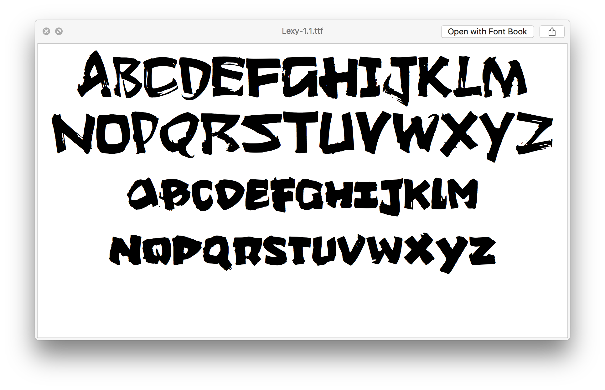

Free for non-commercial use.

## New Version -- 1.1

### Glyphs (75)

- `!` `"` `&` `'`(U+0027) `(` `)` `,` `-` `.` `/` [10]
- `A-Z` [26]
- `:` `;` `?` [3]
- `a-z` [26]
- `0-9` [10]

### Download

- [TTF](typefaces/Lexy-1.1.ttf)

---

# Archived Version

## Version 1.0

### Glyphs (89)

- `!` `"` `#` `$` `%` `&` `(` `)` `*` `+` `,` `-` `.` `/` [14]
- `0-9` [10]
- `:` `;` `<` `=` `>` `?` `@` [7]
- `A-Z` [26]
- `[` `]` [2]
- `a-z` [26]
- `{` `}` `~` `’`(U+2019) [4]

### Download

- [TTF](typefaces/Lexy-1.0.ttf)

